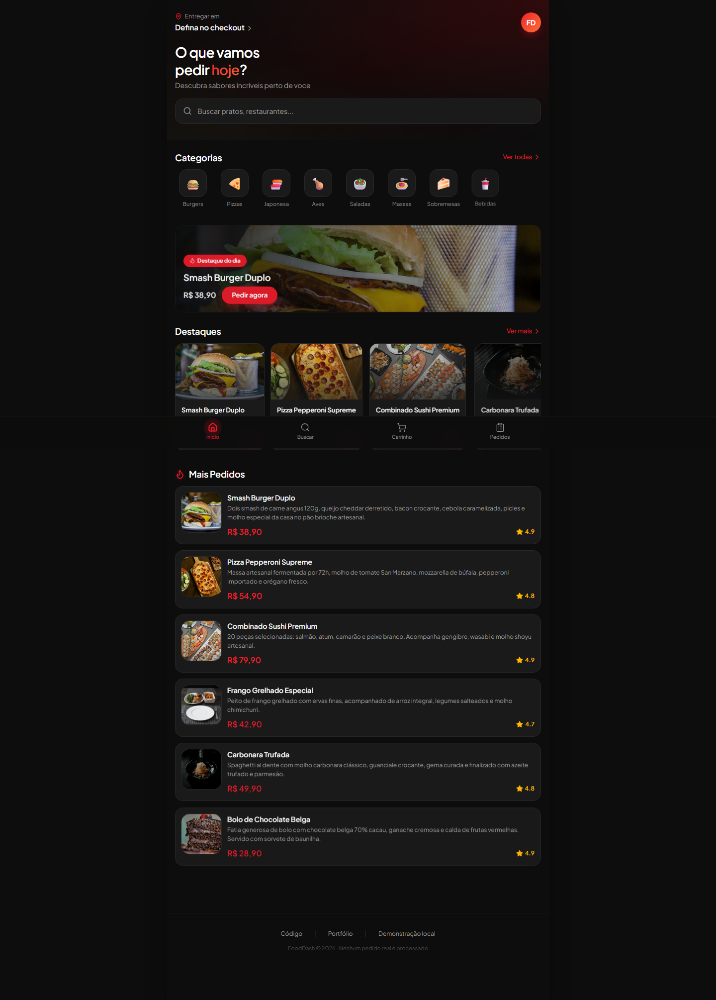
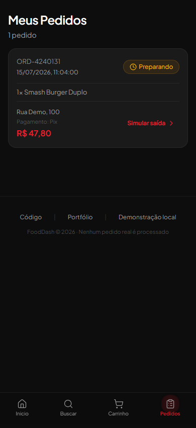
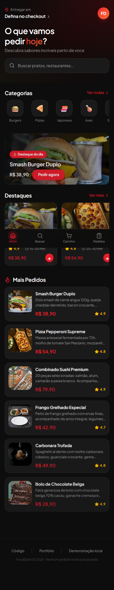

# Plataforma de Pedidos Online

Demonstração mobile-first de um fluxo de pedidos para restaurantes: cardápio, personalização do item, carrinho, checkout, confirmação e acompanhamento. Nenhum pedido ou pagamento real é processado.

[Abrir demonstração](https://plataforma-de-pedidos-online-two.vercel.app/) · [Ver portfólio](https://lipdev.vercel.app/)



## Fluxo demonstrado

1. explore ou pesquise itens no cardápio;
2. escolha adicionais e quantidade;
3. revise o carrinho e a taxa de entrega;
4. informe um endereço fictício e selecione a forma de pagamento;
5. confirme o pedido simulado;
6. acompanhe os estados `Preparando`, `A caminho` e `Entregue`;
7. repita um pedido concluído.

Carrinho, pedidos e andamento são persistidos no `localStorage`. Os dados ficam apenas no navegador e podem ser removidos limpando os dados do site.



## Tecnologias

- React 18;
- TypeScript;
- Vite 6;
- React Router 7;
- Tailwind CSS 4;
- Motion e Lucide React;
- Playwright, ESLint e GitHub Actions.

## Executar localmente

Requisitos: Node.js 22 e npm.

```bash
git clone https://github.com/LipDev-sudo/plataforma-de-pedidos-online-.git
cd plataforma-de-pedidos-online-
npm ci
npm run dev
```

## Verificações

```bash
npm run lint
npm run typecheck
npm run build
npx playwright install chromium
npm test
```

Os testes percorrem o pedido completo em `1440x900` e `390x844`, validando persistência, mudança de status, repetição do pedido, foco do teclado, links e overflow horizontal.

## Screenshots

| Desktop | Mobile |
| --- | --- |
|  |  |

## Limites da demonstração

- não há autenticação, API, banco de dados ou painel administrativo;
- pagamentos são apenas opções visuais;
- estoque, entrega e mudança de status são simulados localmente;
- imagens do cardápio são carregadas de fontes externas.

## Autor

Hamilton Felipe Soares da Silva · [GitHub](https://github.com/LipDev-sudo) · [LinkedIn](https://www.linkedin.com/in/hamilton-felipe-875054383/)

## Licença

Distribuído sob a [licença MIT](LICENSE).
