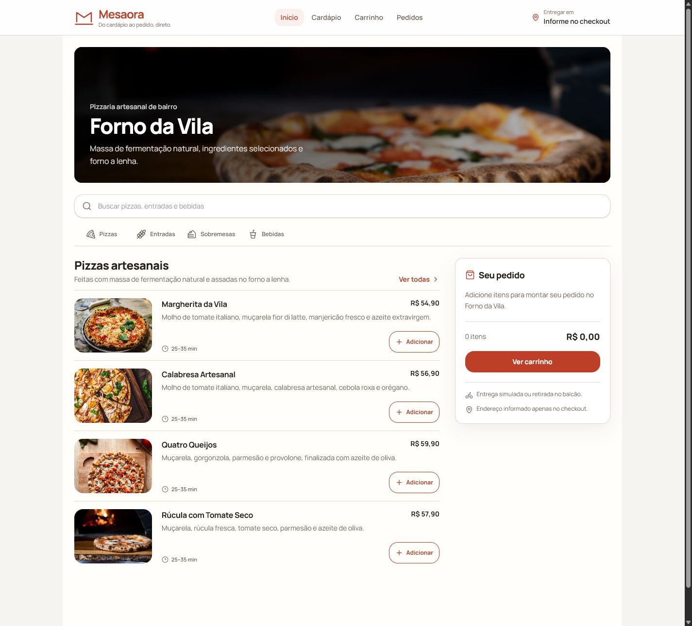

# Mesaora

**Do cardápio ao pedido, direto.**

Mesaora é uma demonstração funcional de cardápio digital e gestão da jornada de pedidos para restaurantes, lanchonetes e pequenos deliveries. O produto é apresentado por meio do **Forno da Vila**, uma pizzaria artesanal fictícia com menu, linguagem e dados consistentes.

[Abrir demonstração](https://plataforma-de-pedidos-online-two.vercel.app/) · [Ver portfólio](https://lipdev.vercel.app/)



> Este é um produto demonstrativo. Nenhum pedido ou pagamento real é processado.

## Proposta do produto

Mesaora organiza uma experiência direta entre o restaurante e o cliente: descoberta do cardápio, personalização do item, carrinho, checkout e acompanhamento do pedido no mesmo fluxo. A interface prioriza o uso no celular sem perder clareza em telas maiores.

## Fluxo demonstrado

1. explore ou pesquise o cardápio do Forno da Vila;
2. escolha uma pizza e seus complementos;
3. revise quantidades e valores no carrinho;
4. informe um endereço fictício e uma forma de pagamento;
5. confirme o pedido simulado;
6. acompanhe os estados `Preparando`, `A caminho` e `Entregue`;
7. repita um pedido concluído.

Carrinho e pedidos são persistidos no `localStorage` do navegador. Os dados podem ser removidos limpando os dados do site.


## Identidade

- **Produto:** Mesaora;
- **Slogan:** Do cardápio ao pedido, direto.;
- **Restaurante demonstrativo:** Forno da Vila;
- **Público:** restaurantes, lanchonetes e pequenos deliveries;
- **Tom:** acolhedor, direto e operacional;
- **Direção visual:** papel quente, vermelho de forno, tipografia limpa e estados semânticos de alto contraste.

## Tecnologias

- React 18;
- TypeScript;
- Vite 6;
- React Router 7;
- Tailwind CSS 4;
- Lucide React;
- Playwright, ESLint e GitHub Actions.

## Executar localmente

Requisitos: Node.js 22 e npm.

```bash
git clone https://github.com/LipDev-sudo/plataforma-de-pedidos-online-.git
cd plataforma-de-pedidos-online-
npm ci
npm run dev
```

## Validações

```bash
npm run typecheck
npm run lint
npm test
npm run build
npm audit
```

Os testes percorrem o fluxo completo em `1440×900` e `390×844`, verificando persistência, mudança de status, repetição do pedido, navegação por teclado, links, metadata, erros de console e overflow horizontal.

## Screenshots

| Desktop | Mobile |
| --- | --- |
|  |  |

## Limites da demonstração

- não há autenticação, API, banco de dados ou painel administrativo;
- pagamentos são apenas opções visuais;
- estoque, entrega e mudança de status são simulados localmente;
- imagens do cardápio são carregadas de fontes externas.

## Autor

Hamilton Felipe Soares da Silva · [GitHub](https://github.com/LipDev-sudo) · [LinkedIn](https://www.linkedin.com/in/hamilton-felipe-875054383/)

## Licença

Distribuído sob a [licença MIT](LICENSE).
